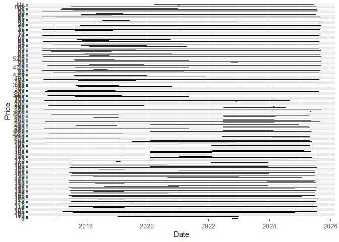

<!-- README.md is generated from README.Rmd. Please edit that file -->

# vegetablesSriLanka

## Installation

You can install the development version of vegetablesSriLanka from
GitHub with:

``` r
# install.packages("pak")
pak::pak("thiyangt/vegetableSriLanka")
```

## Load data

``` r
library(vegetablesSriLanka)
data("vegetables.srilanka")
head(vegetables.srilanka)
#>         Date    Item      Type   Market Price
#> 1 2016-08-01 Pumpkin Wholesale   Pettah    70
#> 2 2016-08-01 Pumpkin Wholesale Dambulla    45
#> 3 2016-08-01 Pumpkin    Retail   Pettah    90
#> 4 2016-08-01 Pumpkin    Retail Dambulla    70
#> 5 2016-08-01 Brinjal Wholesale   Pettah    60
#> 6 2016-08-01 Brinjal Wholesale Dambulla    45
```

``` r
library(tidyverse)
#> ── Attaching core tidyverse packages ──────────────────────── tidyverse 2.0.0 ──
#> ✔ dplyr     1.1.4     ✔ readr     2.1.5
#> ✔ forcats   1.0.0     ✔ stringr   1.5.1
#> ✔ ggplot2   3.5.2     ✔ tibble    3.3.0
#> ✔ lubridate 1.9.4     ✔ tidyr     1.3.1
#> ✔ purrr     1.1.0     
#> ── Conflicts ────────────────────────────────────────── tidyverse_conflicts() ──
#> ✖ dplyr::filter() masks stats::filter()
#> ✖ dplyr::lag()    masks stats::lag()
#> ℹ Use the conflicted package (<http://conflicted.r-lib.org/>) to force all conflicts to become errors
vegetables.srilanka |>
  filter(Item == "Pumpkin") |>
  ggplot(aes(x=Date, y=Price)) + 
  geom_line()
```


